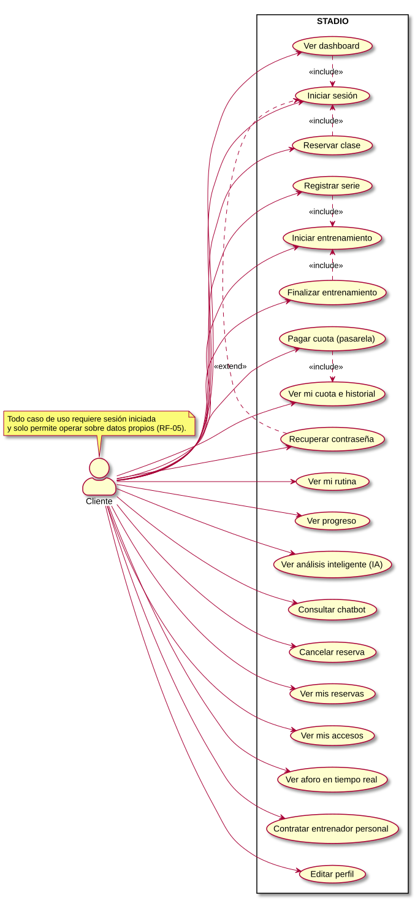
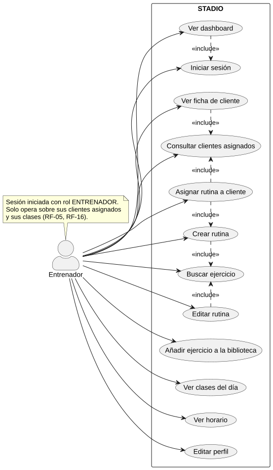
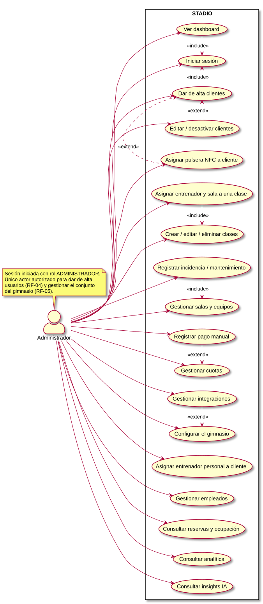
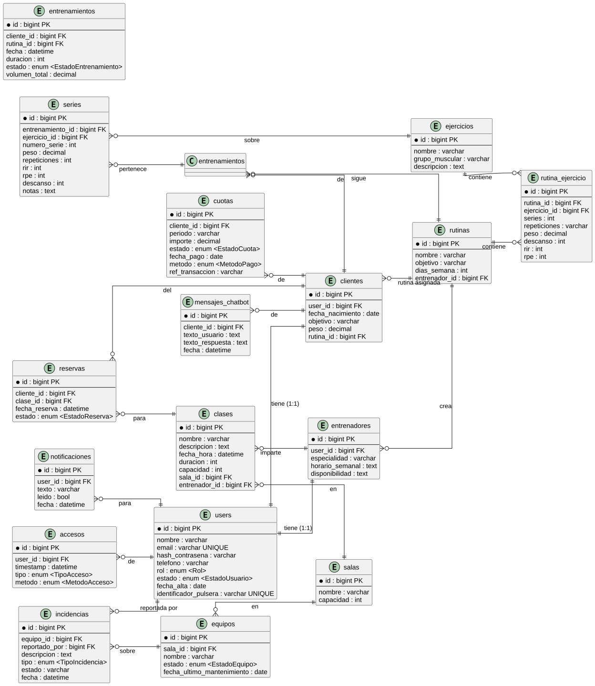

# Stadio 🏋️

> Plataforma web inteligente para la gestión integral de gimnasios.
> Trabajo de Fin de Grado — Universidad de Alicante.

Stadio centraliza la operativa de un gimnasio: clientes, empleados, clases, reservas, rutinas, entrenamiento con seguimiento de progreso, control de accesos NFC, cuotas con Stripe y analítica.

Con **3 roles** con interfaces y permisos diferenciados:

- **Cliente** — dashboard, entrenar, progreso, reservas, accesos, cuota, chatbot
- **Entrenador** — clientes, rutinas, biblioteca de ejercicios, clases, horarios
- **Administrador** — KPIs, empleados, aforo en tiempo real, ingresos, instalaciones, analítica e IA de negocio

Incluye un subsistema de **IA heurística** (detección de estancamientos, sobreentrenamiento e insights de negocio) y un **chatbot** asistente.

## Stack tecnológico

| Capa | Tecnología |
|------|------------|
| Frontend | React 19, TypeScript, Vite 8, Tailwind CSS 4 |
| Backend | Laravel 13 (PHP 8.3), API REST |
| Base de datos | MySQL 8.0 (SQLite para tests) |
| Infra | Docker Compose (PHP-FPM + Nginx + MySQL) |
| Integraciones | NFC (accesos), Stripe (pagos) |

## Requisitos previos

- Docker + Docker Compose
- Node.js + npm

## Puesta en marcha

### Opción recomendada — todo con un script

```bash
./run/dev.sh
```

- Backend → `http://localhost:8000`
- Frontend → `http://localhost:5173` (o la que muestre `npm run dev`)

### Solo backend

```bash
cd backend/stadio
cp .env.example .env
docker compose up -d --build
docker compose exec app php artisan key:generate
docker compose exec app php artisan migrate --force
```

### Solo frontend

```bash
cd frontend/stadio
npm install
npm run dev
```

## Estructura del proyecto

```
stadio/
├── backend/stadio/     # API Laravel (Docker: PHP-FPM + Nginx + MySQL)
├── frontend/stadio/    # SPA React + TypeScript + Vite
├── docs/               # Especificaciones, requisitos, tecnologías y diagramas
├── run/                # Scripts de arranque (dev.sh)
└── README.md
```

## Documentación

- `docs/especificaciones.md` — alcance y modelo de datos
- `docs/requisitos.md` — 88 RF + 27 RNF (priorización MoSCoW)
- `docs/tecnologias.md` — stack tecnológico
- `docs/diagramas/` — casos de uso, entidad-relación y diagramas de secuencia (PlantUML → SVG)

### Casos de uso

| Cliente | Entrenador | Administrador |
|---------|------------|---------------|
|  |  |  |

### Modelo de datos



## Tests y calidad de código

```bash
# Backend (PHPUnit)
composer test

# Frontend (ESLint)
npm run lint
```

## Estado del proyecto

🚧 En desarrollo — proyecto base inicial, sujeto a cambios.

## Licencia

MIT

## Autor

Israel Izquierdo Sanchís — [iis8-ua](https://github.com/iis8-ua)
